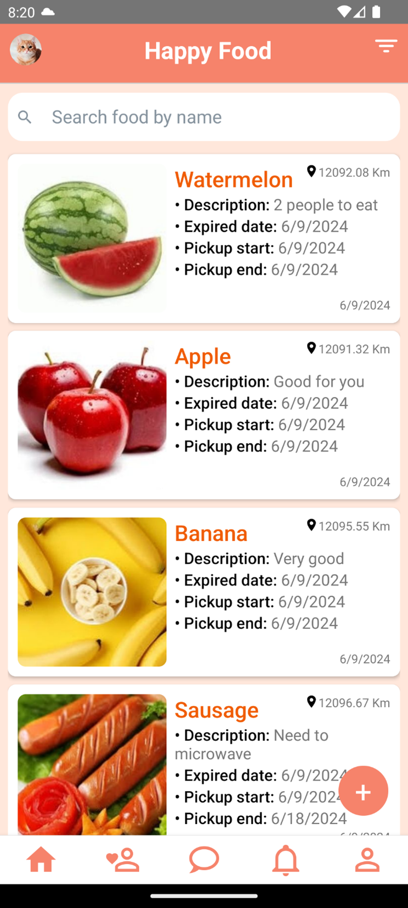

# Food Sharing Application

We are developing a Food Sharing Mobile Application aimed at promoting community sharing and reducing food waste. Our project leverages React Native for a responsive and intuitive front-end experience and Spring Boot for robust backend development, ensuring seamless integration and performance.

## Table Of Contents

- [About the Project](#about-the-project)
  - [Built With](#built-with)
- [Usage](#usage)
- [Authors](#authors)
- [Acknowledgements](#acknowledgements)

## About the Project

### Built With

This project was built with the following technologies:

- [React Native](https://reactnative.dev/)
- [Typescript](https://www.typescriptlang.org/)
- [Spring boot](https://spring.io/projects/spring-boot/)
- [MySQL](https://www.mysql.com/)

## Usage

Start using the app for study, searching food and social media purposes!

## Authors

- **Trương Văn Hoàng Sơn** - _Student_ - [Trương Văn Hoàng Sơn](https://github.com/tvhson) - _21520101_
- **Nguyễn Nguyên Khôi** - _Student_ - [Nguyễn Nguyên Khôi](https://github.com/Khooiiiii) - _21521010_

## Acknowledments

- [Trương Văn Hoàng Sơn](https://github.com/tvhson)
- [Nguyễn Nguyên Khôi](https://github.com/Khooiiiii)
